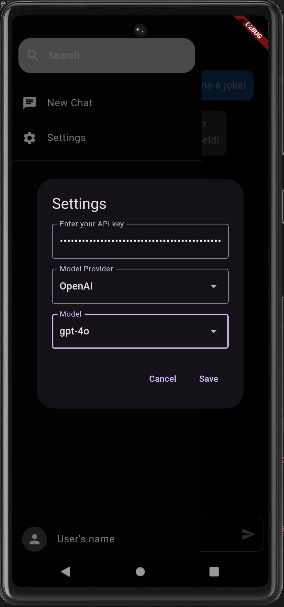
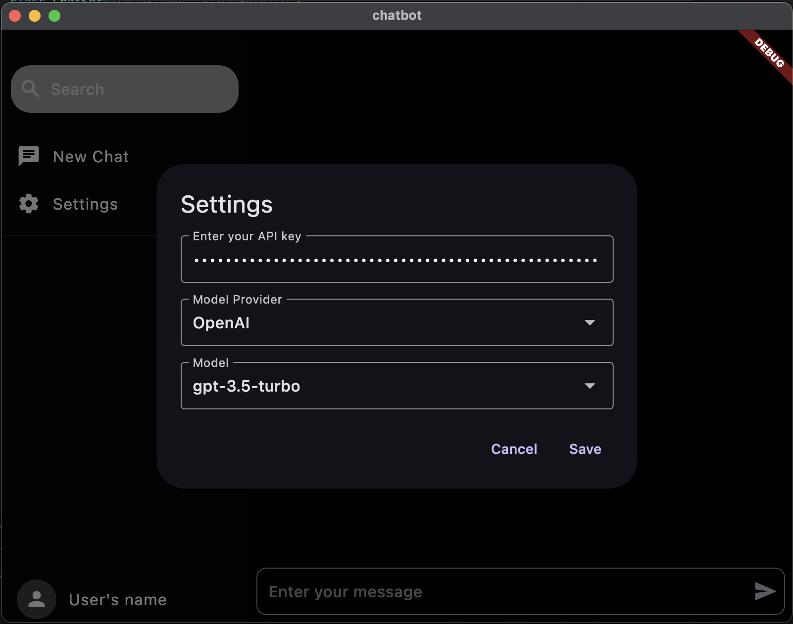

# Chatbot

## Introduction

Chatbot is a cross-platform application that enables users to communicate with AI models like OpenAI's GPT-3.5 and GPT-4. It supports configurable API keys, model selection, and allows for seamless chat interaction. This app works on Android, iOS, Web, and macOS, with potential support for Windows and Linux (untested).

## Table of Contents

- [Features](#features)
- [Screenshots](#screenshots)
- [App Flow](#app-flow)
- [Architecture](#architecture)
- [Setup and Installation](#setup-and-installation)
- [Running the Application](#running-the-application)
- [Dependencies](#dependencies)

## Features

- **Cross-Platform Support**: Works on Android, iOS, Web, and macOS. The app might work on Windows and Linux but hasn't been tested yet.
- **API Key Configuration**: Users can set and update their API key for the AI model.
- **Model Provider and Model Selection**: Supports selecting different AI providers and models (e.g., GPT-3.5, GPT-4).
- **New Chat**: Easily clear chat history and start fresh conversations.
- **Responsive Design**: Optimized UI for both small (mobile) and large (tablet, desktop) screens.
- **Chat Functionality**: Users can interact with AI models through a clean chat interface.
- **Scalable and Maintainable Codebase**: Follows Clean Architecture and SOLID principles.

## Screenshots

### Android

|                 Home                  |                   Settings                    |
| :-----------------------------------: | :-------------------------------------------: |
|  |  |

### iOS

|             Home              |               Settings                |
| :---------------------------: | :-----------------------------------: |
|  |  |

### macOS

|               Home                |                 Settings                  |
| :-------------------------------: | :---------------------------------------: |
|  |  |

### Web

|             Home              |               Settings                |
| :---------------------------: | :-----------------------------------: |
|  |  |

## App Flow

- When the app starts, it loads the saved API key and model preferences from device storage (e.g., SharedPreferences).
- Users can enter an API key and select a model provider via the settings.
- Start a new conversation or clear the chat history using the **New Chat** option.
- Messages are sent to the AI model, and the response is displayed in the chat interface.

## Architecture

The app is built using Clean Architecture, ensuring a clear separation of concerns across the presentation, application, domain, and data layers.

### Directory Structure

```

├── main.dart
└── src
    ├── application
    │   └── services
    │       ├── chat_service.dart
    │       ├── chat_service.g.dart
    │       ├── model_provider_config.dart
    │       └── model_provider_service.dart
    ├── data
    │   ├── chat_api.dart
    │   └── chat_repository.dart
    ├── domain
    │   └── chat_message.dart
    ├── presentation
    │   ├── pages
    │   │   └── chat_page.dart
    │   └── widgets
    │       └── app_drawer.dart
    ├── providers
    │   └── chat_providers.dart
    └── utils
        ├── app_sizes.dart
        └── ext.dart
```

### Layers

1. **Presentation Layer**: Handles the UI and user interactions.
2. **Application Layer**: Contains business logic and services (like handling chat and API key management).
3. **Domain Layer**: Defines core entities (e.g., `ChatMessage`).
4. **Data Layer**: Manages data sources, including API calls to the selected AI model provider.

## Setup and Installation

### Prerequisites

- Flutter SDK installed: [Install Flutter](https://flutter.dev/docs/get-started/install)

### Clone the Repository

```sh
git clone https://github.com/ciriti/Chatbot.git
cd chatbot
```

### Install Dependencies

```sh
flutter pub get
```

## Running the Application

You can run the app on various platforms:

- **Android**: Launch the Android emulator (or connect a device) and then run:

```bash
`flutter run -d android`
```

- **iOS**: Launch the iOS simulator (or connect a physical device) before running:

```bash
`flutter run -d ios`
```

- **macOS**:

```bash
`flutter run -d macos`
```

- **Web**:

```bash
`flutter run -d chrome`
```

For untested platforms (Windows and Linux), try using:

- **Windows**: `flutter run -d windows`
- **Linux**: `flutter run -d linux`

## Dependencies

- `flutter_riverpod`: For state management.
- `dio`: For making HTTP requests.
- `shared_preferences`: For storing API keys and other settings.
- `responsive_builder`: For responsive UI on different screen sizes.
- `flutter_dotenv`: For managing environment variables.
